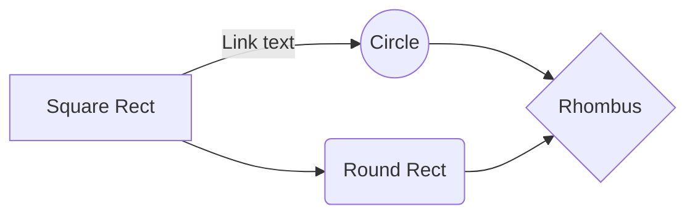

# Exemplos de Paneil

## UML com Markdown:

---
## Painel Simples (1 | 1)

  

    Seção 1: Resumo

    **Indicadores Principais**
    - **Vendas Totais:** $10,000
    - **Clientes Novos:** 50
    - **Taxa de Conversão:** 5%

    ## Seção 2: Gráficos

    
  

  

    Seção 3: Tabelas

    | Mês       | Vendas | Clientes Novos |
    |-----------|--------|----------------|
    | Janeiro   | $1,000 | 10             |
    | Fevereiro | $1,200 | 12             |
    | Março     | $1,500 | 15             |
  

---
## Painel divido em 3  (1 | 1/1)

  

    <h2>Coluna 1</h2>
    
Conteúdo da Coluna 1
    

  

  

    <h2>Coluna 2</h2>
    
Conteúdo da Coluna 2

    <h2>Coluna 3</h2>
    
Conteúdo da Coluna 3

  

---
##  Painel divido em 4 (2|2)

  

    <h2>C</h2>
    <pre><code>
#include <stdio.h>

int main() {
  printf("Olá, mundo!\n");
  return 0;
}
    </code></pre>
  

  

    <h2>Java</h2>
    <pre><code>
public class Main {
  public static void main(String[] args) {
    System.out.println("Olá, mundo!");
  }
}
    </code></pre>
    <h2>Python</h2>
    <pre><code>
print("Olá, mundo!")
    </code></pre>
  

---
## Painel divido em 3  (1 | 1/1)

  

    <h2>C</h2>
    <pre><code>
#include <stdio.h>

int main() {
  printf("Olá, mundo!\n");
  return 0;
}
    </code></pre>
  

  

    <h2>Java</h2>
    <pre><code>
public class Main {
  public static void main(String[] args) {
    System.out.println("Olá, mundo!");
  }
}
    </code></pre>
    <h2>Python</h2>
    <pre><code>
print("Olá, mundo!")
    </code></pre>
  

---
## Painel horizontal em 4 (1|1|1|1)

  

    <h2>C</h2>
    <pre><code>
#include <stdio.h>

int main() {
  printf("Olá, mundo!\n");
  return 0;
}
    </code></pre>
  

  

    <h2>Java</h2>
    <pre><code>
public class Main {
  public static void main(String[] args) {
    System.out.println("Olá, mundo!");
  }
}
    </code></pre>
  

  

    <h2>Python</h2>
    <pre><code>
print("Olá, mundo!")
    </code></pre>
  

  

    <h2>JavaScript</h2>
    <pre><code>
console.log("Olá, mundo!");
    </code></pre>
  

--- 
## Painel com espaçamento horizontal em 4 (2/2)

  

    

      <h2>C</h2>
      <pre><code>
#include <stdio.h>

int main() {
  printf("Olá, mundo!\n");
  return 0;
}
      </code></pre>
    

    

      <h2>Java</h2>
      <pre><code>
public class Main {
  public static void main(String[] args) {
    System.out.println("Olá, mundo!");
  }
}
      </code></pre>
    

  

  

    

      <h2>Python</h2>
      <pre><code>
print("Olá, mundo!")
      </code></pre>
    

    

      <h2>JavaScript</h2>
      <pre><code>
console.log("Olá, mundo!");
      </code></pre>
    

  

---
## Painel sem espaçamento horizontal em 4 (2/2)

  

    

      <h2>C</h2>
      <pre><code>
#include <stdio.h>

int main() {
  printf("Olá, mundo!\n");
  return 0;
}
      </code></pre>
    

    

      <h2>Java</h2>
      <pre><code>
public class Main {
  public static void main(String[] args) {
    System.out.println("Olá, mundo!");
  }
}
      </code></pre>
    

  

  

    

      <h2>Python</h2>
      <pre><code>
print("Olá, mundo!")
      </code></pre>
    

    

      <h2>JavaScript</h2>
      <pre><code>
console.log("Olá, mundo!");
      </code></pre>
    

  

---
## Painel com espaçamento horizontal em 3 (1|1|1)

  

    <h2 style="color: #f0f0f0;">C</h2>
    

    <pre style="color: #ddd; font-size: 16px;"><code>
#include <stdio.h>

int main() {
  printf("Olá, mundo!\n");
  return 0;
}
    </code></pre>
  

  

    <h2 style="color: #f0f0f0;">Python</h2>
    

    <pre style="color: #ddd; font-size: 16px;"><code>
print("Olá, mundo!")
    </code></pre>
  

  

    <h2 style="color: #f0f0f0;">Java</h2>
    

    <pre style="color: #ddd; font-size: 16px;"><code>
public class Main {
  public static void main(String[] args) {
    System.out.println("Olá, mundo!");
  }
}
    </code></pre>
  

  

    <h2 style="color: #f0f0f0;">JavaScript</h2>
    

    <pre style="color: #ddd; font-size: 16px;"><code>
console.log("Olá, mundo!");
    </code></pre>
  

---
## Painel horizontal em 4 (1|1|1|1)

  

    <h2>C</h2>
    <pre><code>
#include <stdio.h>

int main() {
  printf("Olá, mundo!\n");
  return 0;
}
    </code></pre>
  

  

    <h2>Python</h2>
    <pre><code>
print("Olá, mundo!")
    </code></pre>
  

  

    <h2>Java</h2>
    <pre><code>
public class Main {
  public static void main(String[] args) {
    System.out.println("Olá, mundo!");
  }
}
    </code></pre>
  

  

    <h2>JavaScript</h2>
    <pre><code>
console.log("Olá, mundo!");
    </code></pre>
  

---
## Painel com borda divido em 4 (2/2)

  

    

      <h2>C</h2>
      
Este é um pequeno texto sobre a linguagem C.

      <pre><code>
#include <stdio.h>

int main() {
  printf("Olá, mundo!\n");
  return 0;
}
      </code></pre>
    

    

      <h2>Java</h2>
      
Este é um pequeno texto sobre a linguagem Java.

      <pre><code>
public class Main {
  public static void main(String[] args) {
    System.out.println("Olá, mundo!");
  }
}
      </code></pre>
    

  

  

    

      <h2>Python</h2>
      
Este é um pequeno texto sobre a linguagem Python.

      <pre><code>
print("Olá, mundo!")
      </code></pre>
    

    

      <h2>JavaScript</h2>
      
Este é um pequeno texto sobre a linguagem JavaScript.

      <pre><code>
console.log("Olá, mundo!");
      </code></pre>
    

  

---
# Painel com borda em colunas

  

    <h2>C</h2>
    
Este é um pequeno texto sobre a linguagem C.

    <pre><code>
#include <stdio.h>

int main() {
  printf("Olá, mundo!\n");
  return 0;
}
    </code></pre>
  

  

    <h2>Java</h2>
    
Este é um pequeno texto sobre a linguagem Java.

    <pre><code>
public class Main {
  public static void main(String[] args) {
    System.out.println("Olá, mundo!");
  }
}
    </code></pre>
  

  

    <h2>Python</h2>
    
Este é um pequeno texto sobre a linguagem Python.

    <pre><code>
print("Olá, mundo!")
    </code></pre>
  

  

    <h2>JavaScript</h2>
    
Este é um pequeno texto sobre a linguagem JavaScript.

    <pre><code>
console.log("Olá, mundo!");
    </code></pre>
  

