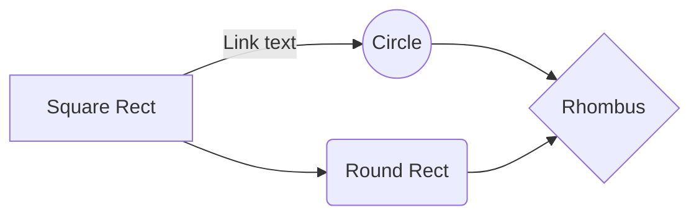

# Exemplos de Paneil

## UML com Markdown:
#### Você pode encontrar mais informações sobre UML e a sintaxe Mermaid online.

---
## Painel Simples (1 | 1)
<table>
  <tr>
    <td>
      <strong>Indicadores Principais</strong> 
      <strong>Vendas Totais:</strong> $10,000 
      <strong>Clientes Novos:</strong> 50 
      <strong>Taxa de Conversão:</strong> 5%
    </td>
    <td>
      <strong>Mês</strong> | <strong>Vendas</strong> | <strong>Clientes Novos</strong> 
      Janeiro | $1,000 | 10 
      Fevereiro | $1,200 | 12 
      Março | $1,500 | 15
    </td>
  </tr>
</table>

---
## Painel divido em 3  (1 | 1/1)
<table>
  <tr>
    <td style="width: 33%;">
      <h2>Coluna 1</h2>
      
Conteúdo da Coluna 1

    </td>
    <td style="width: 66%;">
      <h2>Coluna 2</h2>
      
Conteúdo da Coluna 2

      <h2>Coluna 3</h2>
      
Conteúdo da Coluna 3

    </td>
  </tr>
</table>

---
##  Painel divido em 3 (1|1|1)
<table>
  <tr>
    <td style="width: 33%;">
      <h2>C</h2>
      <pre><code>
#include <stdio.h>

int main() {
  printf("Olá, mundo!\n");
  return 0;
}
      </code></pre>
    </td>
    <td style="width: 33%;">
      <h2>Java</h2>
      <pre><code>
public class Main {
  public static void main(String[] args) {
    System.out.println("Olá, mundo!");
  }
}
      </code></pre>
    </td>
    <td style="width: 33%;">
      <h2>Python</h2>
      <pre><code>
print("Olá, mundo!")
      </code></pre>
    </td>
  </tr>
</table>

---
## Painel divido em 3  (1 | 1/1)
<table>
  <tr>
    <td style="width: 50%;">
      <h2>C</h2>
      <pre><code>
#include <stdio.h>

int main() {
  printf("Olá, mundo!\n");
  return 0;
}
      </code></pre>
    </td>
    <td style="width: 50%;">
      <h2>Java</h2>
      <pre><code>
public class Main {
  public static void main(String[] args) {
    System.out.println("Olá, mundo!");
  }
}
      </code></pre>
      <h2>Python</h2>
      <pre><code>
print("Olá, mundo!")
      </code></pre>
    </td>
  </tr>
</table>

---
## Painel horizontal em 4 (1|1|1|1)
<table>
  <tr>
    <td style="width: 25%;">
      <h2>C</h2>
      <pre><code>
#include <stdio.h>

int main() {
  printf("Olá, mundo!\n");
  return 0;
}
      </code></pre>
    </td>
    <td style="width: 25%;">
      <h2>Java</h2>
      <pre><code>
public class Main {
  public static void main(String[] args) {
    System.out.println("Olá, mundo!");
  }
}
      </code></pre>
    </td>
    <td style="width: 25%;">
      <h2>Python</h2>
      <pre><code>
print("Olá, mundo!")
      </code></pre>
    </td>
    <td style="width: 25%;">
      <h2>JavaScript</h2>
      <pre><code>
console.log("Olá, mundo!");
      </code></pre>
    </td>
  </tr>
</table>

--- 
## Painel com espaçamento horizontal em 4 (2/2)
<table>
  <tr>
    <td style="width: 50%; vertical-align: top;">
      <table>
        <tr>
          <td style="width: 50%;">
            <h2>C</h2>
            <pre><code>
#include <stdio.h>

int main() {
  printf("Olá, mundo!\n");
  return 0;
}
            </code></pre>
          </td>
          <td style="width: 50%;">
            <h2>Java</h2>
            <pre><code>
public class Main {
  public static void main(String[] args) {
    System.out.println("Olá, mundo!");
  }
}
            </code></pre>
          </td>
        </tr>
      </table>
    </td>
    <td style="width: 50%; vertical-align: top;">
      <table>
        <tr>
          <td style="width: 50%;">
            <h2>Python</h2>
            <pre><code>
print("Olá, mundo!")
            </code></pre>
          </td>
          <td style="width: 50%;">
            <h2>JavaScript</h2>
            <pre><code>
console.log("Olá, mundo!");
            </code></pre>
          </td>
        </tr>
      </table>
    </td>
  </tr>
</table>

---
## Painel sem espaçamento horizontal em 4 (2/2)
<table>
  <tr>
    <td style="width: 50%; vertical-align: top;">
      <h2>C</h2>
      <pre><code>
#include <stdio.h>

int main() {
  printf("Olá, mundo!\n");
  return 0;
}
      </code></pre>
      <h2>Java</h2>
      <pre><code>
public class Main {
  public static void main(String[] args) {
    System.out.println("Olá, mundo!");
  }
}
      </code></pre>
    </td>
    <td style="width: 50%; vertical-align: top;">
      <h2>Python</h2>
      <pre><code>
print("Olá, mundo!")
      </code></pre>
      <h2>JavaScript</h2>
      <pre><code>
console.log("Olá, mundo!");
      </code></pre>
    </td>
  </tr>
</table>

---
## Painel com espaçamento horizontal em 3 (1|1|1)
<table>
  <tr>
    <td style="width: 33%; padding: 10px; vertical-align: top; background-color: #333;">
      <h2 style="color: #f0f0f0;">C</h2>
      

      <pre style="color: #ddd; font-size: 16px;"><code>
#include <stdio.h>

int main() {
  printf("Olá, mundo!\n");
  return 0;
}
      </code></pre>
    </td>
    <td style="width: 33%; padding: 10px; vertical-align: top; background-color: #333;">
      <h2 style="color: #f0f0f0;">Python</h2>
      

      <pre style="color: #ddd; font-size: 16px;"><code>
print("Olá, mundo!")
      </code></pre>
    </td>
    <td style="width: 33%; padding: 10px; vertical-align: top; background-color: #333;">
      <h2 style="color: #f0f0f0;">Java</h2>
      

      <pre style="color: #ddd; font-size: 16px;"><code>
public class Main {
  public static void main(String[] args) {
    System.out.println("Olá, mundo!");
  }
}
      </code></pre>
    </td>
    <td style="width: 33%; padding: 10px; vertical-align: top; background-color: #333;">
      <h2 style="color: #f0f0f0;">JavaScript</h2>
      

      <pre style="color: #ddd; font-size: 16px;"><code>
console.log("Olá, mundo!");
      </code></pre>
    </td>
  </tr>
</table>

---
## Painel horizontal em 4 (1|1|1|1)
<table>
  <tr>
    <td style="width: 25%; padding: 10px; vertical-align: top;">
      <h2>C</h2>
      <pre><code>
#include <stdio.h>

int main() {
  printf("Olá, mundo!\n");
  return 0;
}
      </code></pre>
    </td>
    <td style="width: 25%; padding: 10px; vertical-align: top;">
      <h2>Python</h2>
      <pre><code>
print("Olá, mundo!")
      </code></pre>
    </td>
    <td style="width: 25%; padding: 10px; vertical-align: top;">
      <h2>Java</h2>
      <pre><code>
public class Main {
  public static void main(String[] args) {
    System.out.println("Olá, mundo!");
  }
}
      </code></pre>
    </td>
    <td style="width: 25%; padding: 10px; vertical-align: top;">
      <h2>JavaScript</h2>
      <pre><code>
console.log("Olá, mundo!");
      </code></pre>
    </td>
  </tr>
</table>

---
## Painel com borda divido em 4 (2/2)
<table>
  <tr>
    <td style="width: 50%; padding: 10px; vertical-align: top;">
      

        <h2>C</h2>
        
Este é um pequeno texto sobre a linguagem C.

        <pre><code>
#include <stdio.h>

int main() {
  printf("Olá, mundo!\n");
  return 0;
}
        </code></pre>
      

      

        <h2>Java</h2>
        
Este é um pequeno texto sobre a linguagem Java.

        <pre><code>
public class Main {
  public static void main(String[] args) {
    System.out.println("Olá, mundo!");
  }
}
        </code></pre>
      

    </td>
    <td style="width: 50%; padding: 10px; vertical-align: top;">
      

        <h2>Python</h2>
        
Este é um pequeno texto sobre a linguagem Python.

        <pre><code>
print("Olá, mundo!")
        </code></pre>
      

      

        <h2>JavaScript</h2>
        
Este é um pequeno texto sobre a linguagem JavaScript.

        <pre><code>
console.log("Olá, mundo!");
        </code></pre>
      

    </td>
  </tr>
</table>

---
# Painel com borda em colunas
<table style="width: 100%; border-collapse: collapse;">
  <tr>
    <td style="width: 48%; padding: 10px; border: 1px solid #ccc; vertical-align: top;">
      <h2>C</h2>
      
Este é um pequeno texto sobre a linguagem C.

      <pre><code>
#include <stdio.h>

int main() {
  printf("Olá, mundo!\n");
  return 0;
}
      </code></pre>
    </td>
    <td style="width: 48%; padding: 10px; border: 1px solid #ccc; vertical-align: top;">
      <h2>Java</h2>
      
Este é um pequeno texto sobre a linguagem Java.

      <pre><code>
public class Main {
  public static void main(String[] args) {
    System.out.println("Olá, mundo!");
  }
}
      </code></pre>
    </td>
  </tr>
  <tr>
    <td style="width: 48%; padding: 10px; border: 1px solid #ccc; vertical-align: top;">
      <h2>Python</h2>
      
Este é um pequeno texto sobre a linguagem Python.

      <pre><code>
print("Olá, mundo!")
      </code></pre>
    </td>
    <td style="width: 48%; padding: 10px; border: 1px solid #ccc; vertical-align: top;">
      <h2>JavaScript</h2>
      
Este é um pequeno texto sobre a linguagem JavaScript.

      <pre><code>
console.log("Olá, mundo!");
      </code></pre>
    </td>
  </tr>
</table>
